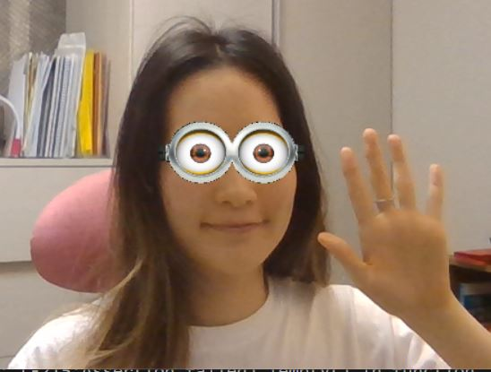

## Make Fun Minions Filter with OpenCV 😊

+ Real time Minions eye filter using simple OpenCV libraries
+ Used CascadeClassifier instead of Dlib for efficient real-time application

<p style="margin-top: 40px; margin-bottom: 40px;">
  
</p>

##  👇 Getting started 👇
1. Clone this repository and navigate to this folder
2. run face_filter.py file

```
python face_filter.py
```

3. Enjoy cute and fun Minions filter!😍

(If you want to develop this filter further, feel free to make advanced filter that minion eyes follow your gaze)

